# 🛡️ Job Scam Checker

Students get fake internship and job offers that ask for fees, documents or bank details. Paste an offer message (or upload the offer letter as a PDF) and get a risk verdict with evidence and advice **before** you reply or pay.

**Live demo:** [http://3.27.3.252:8501](http://3.27.3.252:8501)

*Hosted on AWS EC2 with Docker. The link is HTTP only, so please don't paste real personal details. If the link is down, run it locally using the steps below.*

## How it works

```
Message / PDF
   │
   ├─► Deterministic checks (no LLM)
   │     sender email · WHOIS domain age · website check · scam phrases ·
   │     sensitive-data requests · payment patterns · lookalike domains
   │
   ├─► LangChain chain 1: structured extraction
   │     (claimed company, asks for money, asks for documents)
   │
   ├─► Rule-based risk score (0-100)
   │
   ├─► LangChain chain 2: LLM second opinion (only if score < 30)
   │
   └─► LangChain chain 3: report writer → validated Pydantic report
         + follow-up chat chain (with conversation history)
```

Design choices:
- **Rules decide the score.** Results are consistent, cheap and explainable.
- **The LLM adds language understanding**, catching polished scams that phrase rules miss.
- **Corroboration rules** stop the LLM alone from flagging weak signals (for example, a document request is only counted when another warning sign exists).
- **Every LLM call has retries and a fallback**, so the app never crashes on an API error.

## Features
- Paste text or upload a PDF offer letter
- Optional sender email field
- Colour-coded verdict, risk score and evidence with severity badges
- Follow-up chat ("Why is this suspicious?")
- Feedback buttons (👍 / 👎) that can feed future test sets
- Scam-reporting guidance (cybercrime.gov.in, 1930 helpline)

## Screenshots

### Scam detected
<p>
  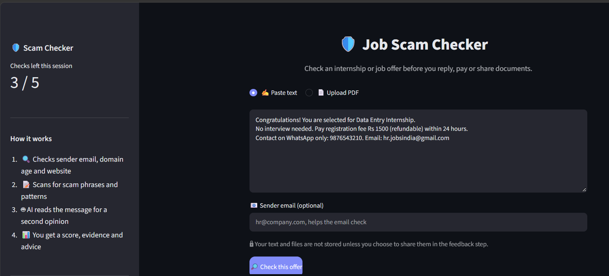
  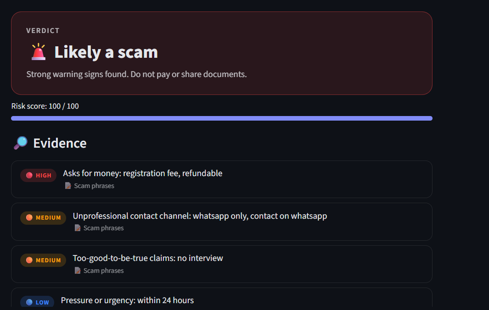
</p>

### Suspicious (AI review used)
<p>
  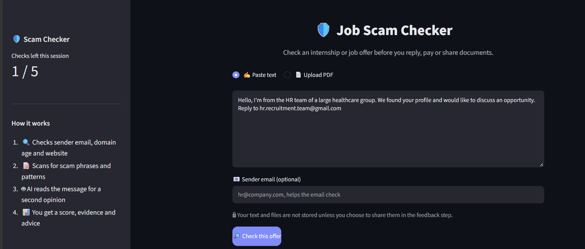
  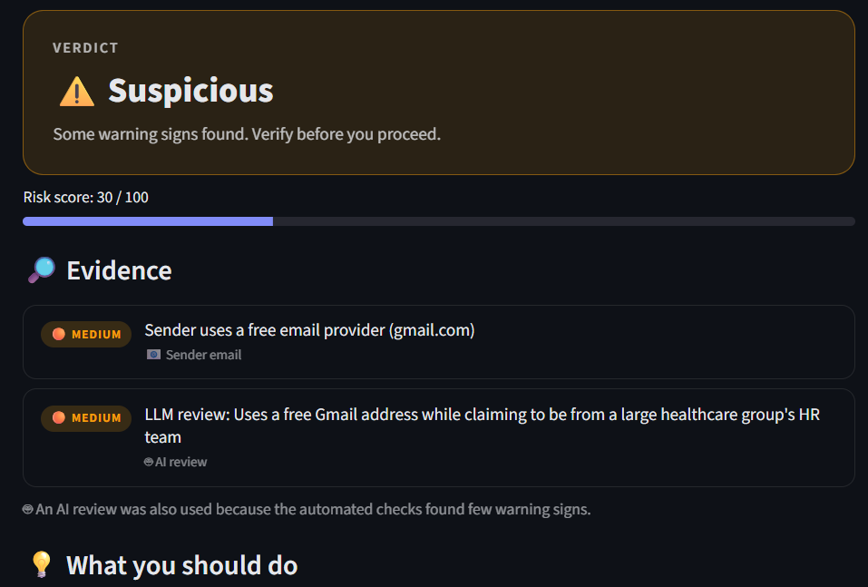
  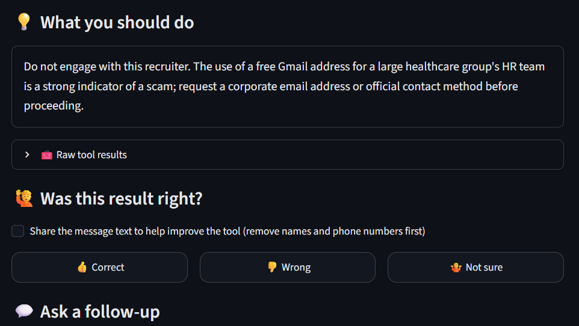
</p>

### Genuine offers
<p>
  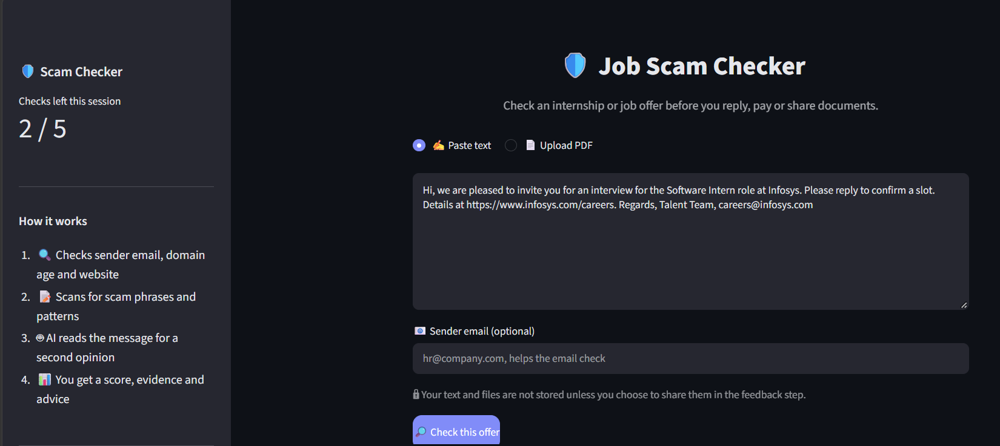
  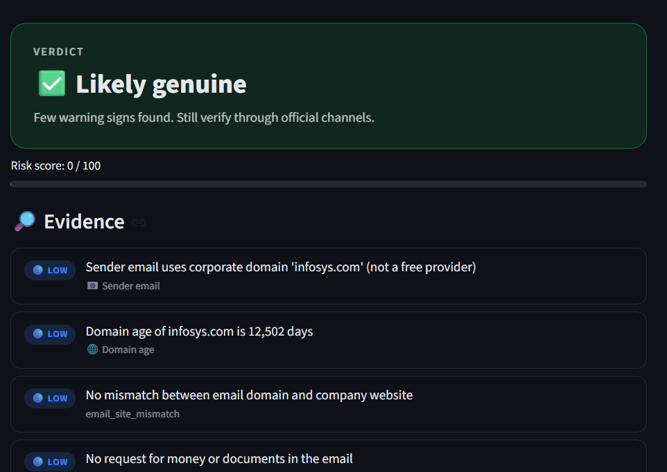
  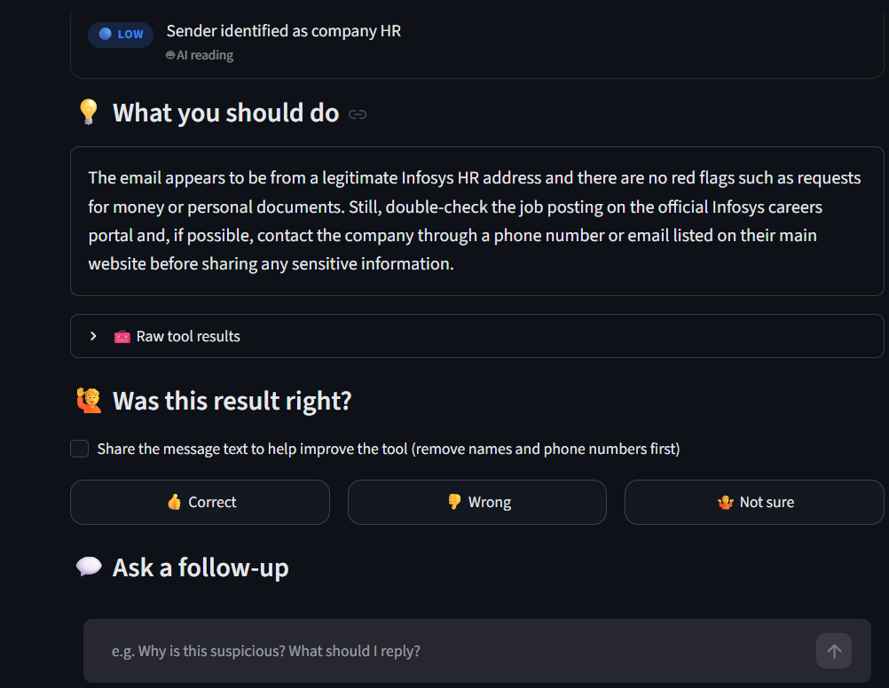
  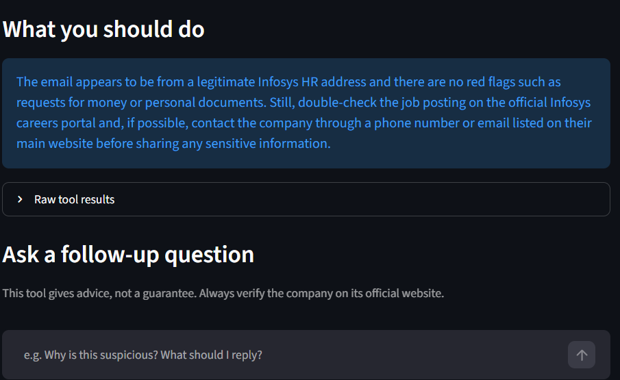
</p>

### PDF offer-letter check
<p>
  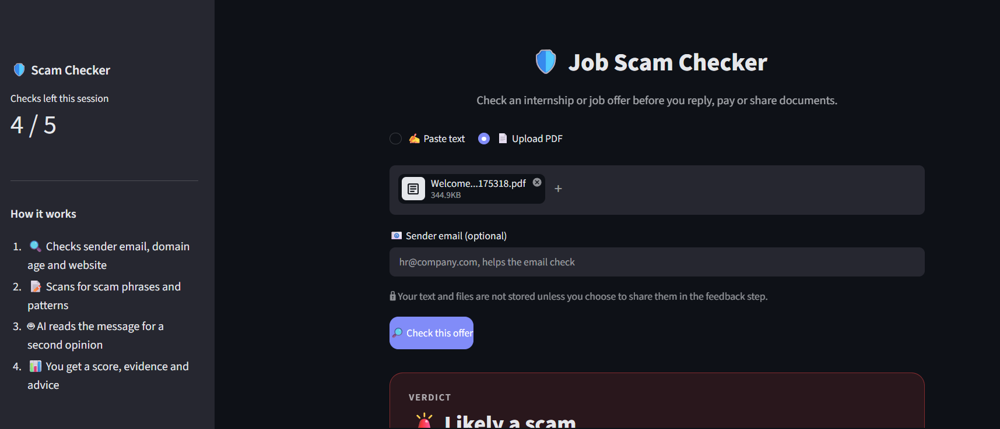
  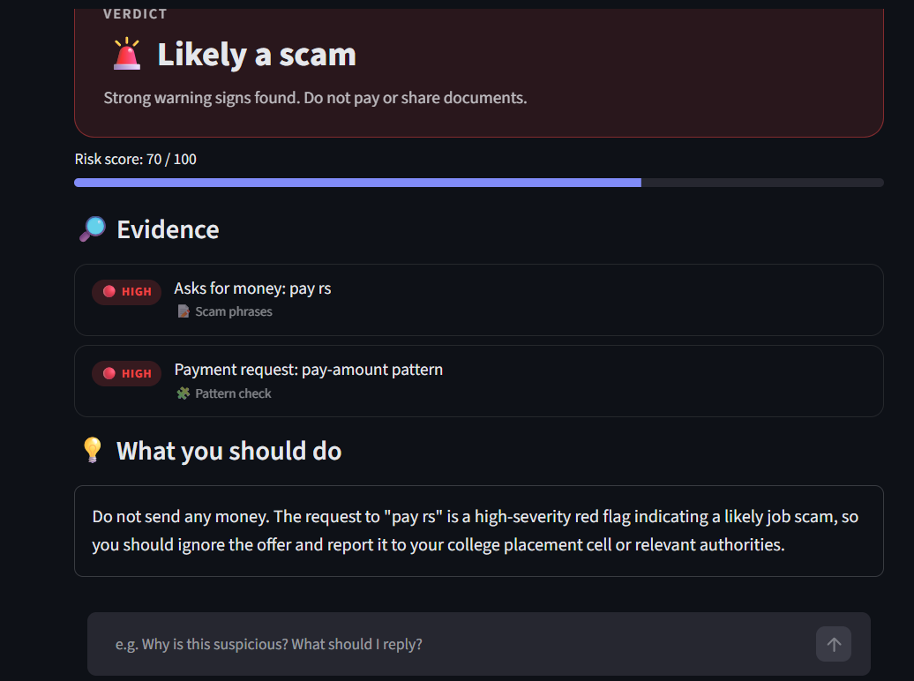
</p>

## Tech stack
Python · LangChain · Groq (`openai/gpt-oss-120b`) · Pydantic · Streamlit · python-whois · BeautifulSoup · tldextract · pypdf · pytest · Docker · AWS EC2

## Results

"Tuned on" means I changed rules or prompts after seeing that set's failures, so the number is optimistic. "Unseen" means nothing was tuned on it.

| Set | Version | Accuracy | Recall | False positive rate | Status |
|---|---|---|---|---|---|
| Main (45) | Rules v1 | 75.6% | 56.5% | 4.5% | baseline |
| Main (45) | Hybrid v2, final | 97.8% | 95.7% | 0.0% | tuned on |
| Fresh 1 (10) | Rules, before tuning | 50.0% | 0.0% | 0.0% | unseen |
| Fresh 2 (10) | Rules only | 60.0% | 20.0% | 0.0% | unseen |
| Fresh 2 (10) | Rules + LLM | 90.0% | 80.0% | 0.0% | prompt shaped after seeing it |
| Final (16) | Rules only | 68.8% | 22.2% | 0.0% | unseen |
| Final (16) | Hybrid, before fixes | 68.8% | 77.8% | 42.9% | unseen |
| Final (16) | Hybrid, after fixes | 87.5% | 77.8% | 0.0% | tuned on |
| **Clean (14)** | **Hybrid v2** | **78.6%** | **71.4%** | **14.3%** | **unseen, headline** |

**Headline:** on 14 unseen real messages the tool caught 5 of 7 scams and wrongly flagged 1 of 7 genuine messages. With sets this small, one message moves accuracy by about 7 points, so treat these numbers as indicative.

Full table with confusion counts: [RESULTS.md](RESULTS.md).

### What each component contributes (final set, 16 unseen messages)

| Version | Recall | False positive rate |
|---|---|---|
| Rules only | 22.2% | 0.0% |
| Rules + LLM chains (before fixes) | 77.8% | 42.9% |

Rules never falsely accuse a company but miss polished scams. The LLM catches most of them but initially flagged routine platform emails, which I fixed by telling it about recruiting platforms and requiring corroboration for weak signals.

## What I learned
- Numbers on sets I tuned on (90%+) did not predict performance on unseen sets (50-79%), so I report the unseen ones.
- The LLM raised false positives on the main set (0% → 9.1%). I traced them to two weak signals, added a corroboration rule, and got back to 0%.
- A hand-written allowlist of recruiting platforms generalises only as far as the list does.

## Error analysis (clean set)

| Message | Result | Cause |
|---|---|---|
| Beacon Hill Search (scam) | Missed | Polished recruiter outreach, no rule fired, LLM treated it as normal |
| Pacifica Companies (scam) | Missed | Polished text with only a weak signal |
| Minfy Technologies (genuine) | False positive | Sent via Keka (`kekamail.com`), not in my platform allowlist, so the company-vs-domain and website rules fired |

## Dataset

95 messages across five files in `data/`: **75 real** and **20 synthetic**.

- `test_set.csv` (45): 25 real messages plus 20 synthetic messages written in the style of real offers.
- `fresh_set.csv` (10), `fresh_set2.csv` (10), `final_set.csv` (16), `final_set2.csv` (14): all real messages.

The headline numbers come from the clean set, which is entirely real. Personal names, phone numbers and personal mailboxes were removed; company domains were kept because the tools check them. Company names are used only as realistic examples. The synthetic messages are fictional and do not come from the companies named.

## Limitations and future work

**Evaluation**
- The headline number comes from 14 unseen real messages, so one message moves accuracy by about 7 points. Next step: collect 50+ real messages, using the feedback buttons as a source.
- Rules and prompts were tuned on earlier sets, so only the clean set is a fair estimate. Next step: keep a locked test set that is never used for tuning.

**Detection**
- Polished scams with no payment request, odd domain or sensitive-data ask are often missed (for example Beacon Hill, Pacifica). Next step: add sender-reputation data and compare against known scam reports.
- The recruiting-platform allowlist is hand-written, so legitimate senders outside it (such as Keka) can be flagged. Next step: replace it with a maintained list of platform sending domains.

**Data sources**
- WHOIS can fail or be blocked, and some large sites block bots. These are treated as "unknown", not as suspicious, so they never raise a score by themselves.
- PDF upload supports text PDFs only (no OCR) and was tried on a few letters, not evaluated. Next step: add OCR for scanned letters and image screenshots.

**Scope**
- This is an advisory tool. It cannot confirm that an offer is genuine, so users should still verify the company on its official website.

## Run locally

```bash
git clone https://github.com/thisaditii/scam-checker.git
cd scam-checker
python -m venv venv
venv\Scripts\activate
pip install -r requirements.txt
```

Create a `.env` file:

```
GROQ_API_KEY=your_key_here
```

Then:

```bash
streamlit run app.py
pytest test_rules.py
python evaluate.py data/test_set.csv
python evaluate_hybrid.py data/final_set2.csv
```

## Run with Docker

```bash
docker build -t scam-checker .
docker run -d -p 8501:8501 --env-file .env scam-checker
```

The live demo runs this way on an AWS EC2 instance (ap-southeast-2).

## Project structure

```
app.py            Streamlit UI
pipeline.py       tools, scoring, LangChain chains
tools.py          WHOIS, email, phrase and pattern checks
schemas.py        Pydantic models
evaluate*.py      evaluation scripts
test_rules.py     unit tests
Dockerfile        container image for deployment
data/             test sets
ss/               screenshots
prototype/        first version: a tool-calling LangChain agent
scripts/          helper scripts
```

`prototype/` holds my first version (a full tool-calling agent). I moved to a deterministic pipeline because the agent used far more tokens and was less consistent.